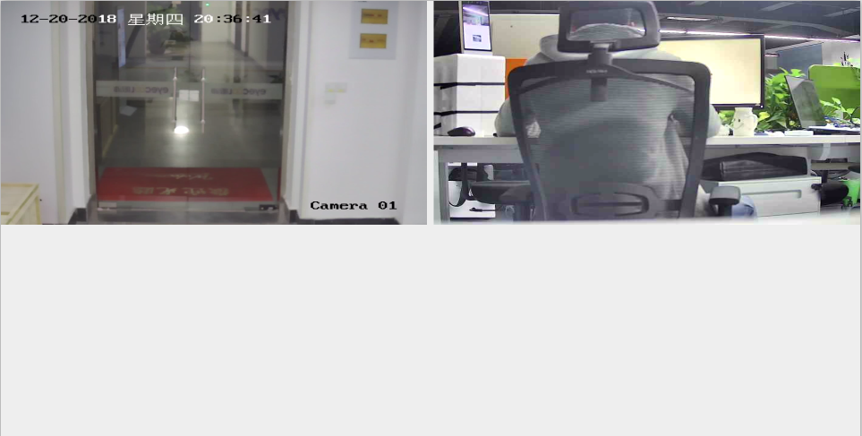

## 这个是使用 海康威视 Android 平台 SDK 访问网络摄像头的简单例子
    使用时请根据自己的网路摄像头 IP地址、用户名、密码替换代码中的参数

### 更新历史
- 项目针对在 Android Studio 3.2 上面做了改动
- 项目针对在 Android 7.0 系统上做了适配，在 jniLibs/armeabi-v7a/下增加了
Android 系统下的动态库文件：libcrypto.so,libnativeloader.so,libssl.so
- 之前是预览一路，现在由于项目要求，要预览 2 路。所以我借了一个摄像头，实现了 2 路。
HikUtil.java 改用创建对象实例，再调用。但是 SDK 初始化，还是直接类调用。

### 效果图

    
    